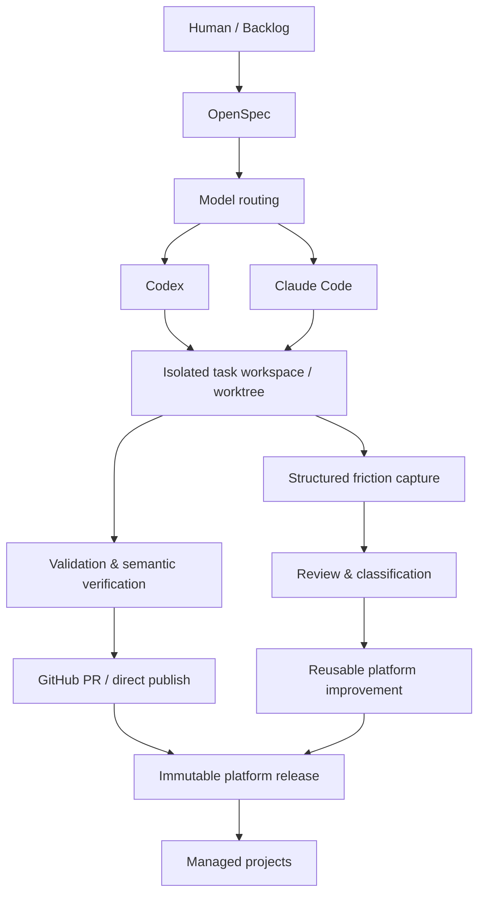

# Dev Platform

**A developer platform for agent-first software development.**

Dev Platform coordinates specifications, coding agents, isolated work, verification, GitHub delivery, releases, and continuous process improvement across multiple repositories.

Once coding agents can generate code quickly, the bottleneck moves to **context, coordination, verification, integration, and lifecycle reliability**. Dev Platform turns those concerns into a versioned engineering lifecycle instead of leaving every repository to reconstruct them from prompts, conventions, and one-off scripts.

`Idea / Task → Spec → Route → Implement → Verify → Publish → Learn`

> [!NOTE]
> This repository is the platform source and Project Factory. Managed projects consume immutable platform releases; they do not execute mutable `dev-platform@main` lifecycle logic.

## Why a platform instead of `AGENTS.md` + scripts?

`AGENTS.md` is necessary, but it is only one layer of the system. Dev Platform combines the agent contract with executable lifecycle primitives and cross-repository release management:

- **specification lifecycle** — OpenSpec turns accepted intent into a durable implementation contract;
- **model routing** — work can be routed to Codex or Claude Code with explicit execution provenance;
- **isolated execution** — feature branches, worktrees, scope ownership, and coordination keep parallel writers from sharing mutable state;
- **verification** — repository checks, semantic OpenSpec verification, and truthful verification receipts are completion gates;
- **GitHub delivery** — PR or deliberately configured direct publication has explicit terminal states and recovery semantics;
- **versioned platform rollout** — Copier, immutable releases, and reviewed downstream upgrades distribute reusable process safely;
- **process learning** — structured friction becomes evidence for reusable platform improvements instead of disappearing in chat history.

The result is a control plane for the engineering lifecycle, not a replacement coding agent.

## Core capabilities

- **Project Factory** for new repositories and conservative adoption of existing ones.
- **OpenSpec lifecycle** from proposal through implementation, verification, archive, and accepted specs.
- **Codex and Claude Code routing** behind one provider-neutral repository contract.
- **Workflow profiles** for single-agent, standard branch-based, and parallel multi-agent work.
- **Isolated workspaces** with worktree and scope coordination where the profile requires them.
- **Risk-proportional validation** plus protected full validation before publication.
- **GitHub-aware publication** with exact PR/direct delivery semantics and resumable recovery.
- **Immutable SemVer releases** and exact-version Copier upgrades.
- **Managed rollout** that opens reviewed upgrade PRs across adopted repositories.
- **Continuous process improvement** through sanitized friction capture and periodic review.

## How it works

A normal change moves through one lifecycle:

1. **Intent becomes a contract.** A small task can stay lightweight; a non-trivial accepted change is described with OpenSpec so implementation does not depend on transient chat context.
2. **The task is routed.** The platform records a bounded routing decision and selects Codex or Claude Code at an appropriate tier.
3. **Implementation is isolated.** The selected workflow profile determines whether the task uses a direct checkout, a feature branch, or a dedicated worktree with coordination metadata.
4. **The result is verified.** Selected checks give fast feedback; required full checks and semantic OpenSpec verification establish completion evidence.
5. **GitHub delivery reaches a terminal state.** A pushed branch, open PR, or green CI run is not treated as delivery until the configured publication lifecycle completes.
6. **Reusable platform changes are released.** Stable platform behavior is published under an immutable SemVer release and distributed to managed projects as exact-version Copier updates.
7. **Friction feeds the next improvement.** High-signal process failures and near-misses can be captured, reviewed, classified, and promoted into reusable platform changes.

## Agent interoperability

The shared rules are provider-neutral. [`AGENTS.md`](AGENTS.md) is the canonical repository-wide contract; provider-specific entrypoints stay deliberately thin rather than copying that contract into separate instruction trees.

For example, [`CLAUDE.md`](CLAUDE.md) points Claude Code back to `AGENTS.md` instead of duplicating the platform rules. Codex and Claude Code integrations then share the same OpenSpec state, lifecycle boundaries, verification requirements, and publication semantics while keeping provider-specific execution details in the routing layer.

See [`docs/engineering/model-routing.md`](docs/engineering/model-routing.md) for routing and execution-provenance details.

## Workflow profiles

Profiles are capability compositions, not separate template forks.

- **`light`** — for small or single-agent repositories that want OpenSpec, checks, and GitHub sync/publish without mandatory feature branches, worktrees, or a coordination board.
- **`standard`** — the default for most repositories: feature branches plus the shared GitHub publication and verification lifecycle.
- **`multi-agent`** — for parallel agent work: `standard` plus isolated worktrees, a machine-local agent board, and explicit scope ownership/coordination.

`workflow_profile` describes which capabilities a repository uses. `harness_mode` is independent: `platform` uses Dev Platform's lifecycle implementation, while `project` lets a mature repository keep a proven repository-specific harness. A repository can therefore use `multi-agent + project` without being forced onto Dev Platform's worktree implementation.

## Quick start

Use an **immutable release tag** from [Releases](https://github.com/lehard/dev-platform/releases), not mutable `main`. The current platform contract tests **Copier 9.17.0** and **OpenSpec CLI 1.6.0**. Generated lifecycle scripts also require a modern Python with `tomllib` support (Python 3.11+).

### Try Dev Platform on a new project

With Git, Python, Copier, and OpenSpec installed:

```bash
copier copy --trust --vcs-ref <release-tag> https://github.com/lehard/dev-platform.git ./my-project
cd ./my-project
python3 scripts/dev.py ready
```

Copier asks for the project name, workflow profile, agent tools, publication policy, and managed-backlog settings. Review operator-specific defaults during that first render rather than accepting settings that belong to somebody else's GitHub installation.

`dev.py ready` is the normal local entrypoint after adoption: it refreshes the configured OpenSpec integrations, synchronizes the integration branch when safe, and runs the platform/agent doctors.

### Adopt an existing project

Do the first render on a dedicated branch or worktree, never directly into a dirty integration checkout:

```bash
git switch -c adopt-dev-platform
copier copy --trust --vcs-ref <release-tag> https://github.com/lehard/dev-platform.git .
```

Review the adoption diff before accepting it. Existing project-specific agent rules and a proven repository-owned lifecycle may remain project-owned; ambiguous ownership is designed to fail closed rather than silently overwrite working process. After reviewing the result:

```bash
python3 scripts/dev.py ready
```

The complete cautious-adoption contract is in [`docs/adoption.md`](docs/adoption.md).

### Use the managed one-command adoption path

Operators running a central Dev Platform installation with its least-privilege GitHub App can use **GitHub Actions → Adopt Project** and provide `owner/name`.

The workflow detects the repository state automatically:

- **fresh** — render, initialize, validate, merge the auditable adoption PR, and promote to managed;
- **existing** — prepare a conservative migration PR for review, then promote after the reviewed migration is merged;
- **adopted** — validate the existing installation and perform managed promotion without recopying it.

This is the normal fleet-management path for the current installation; the local Copier flow above is the portable path for evaluating or operating the platform elsewhere.

### Work in an already adopted clone

```bash
python3 scripts/dev.py ready
```

That command is intentionally the developer-facing readiness entrypoint. Direct Copier update/repair commands are advanced and recovery surfaces; see [`docs/adoption.md`](docs/adoption.md) before using them.

## Architecture



This diagram is conceptual: the implementation has more detailed lifecycle and recovery primitives, but those details should not be required to understand the platform model.

## Safety and reliability

Dev Platform treats lifecycle correctness as part of the product:

- write-capable parallel tasks are isolated and coordinated instead of sharing an integration checkout;
- ambiguous ownership, stale task state, conflicting scope, or unsafe publication state fails closed at the relevant gate;
- force-push/history-rewrite is not the normal recovery mechanism;
- OpenSpec verification records what was actually checked rather than accepting a ceremonial PASS marker;
- a branch push, draft/open PR, or green CI run is intermediate state, not completion;
- platform releases are immutable, and downstream upgrades target exact release tags;
- platform-managed GitHub Actions are SHA-pinned and downstream validation is self-contained;
- mature repositories can preserve a proven project-owned harness instead of being destructively normalized.

See [`docs/engineering/agent-workflow.md`](docs/engineering/agent-workflow.md), [`docs/engineering/openspec-workflow.md`](docs/engineering/openspec-workflow.md), and [`docs/release-policy.md`](docs/release-policy.md) for the detailed contracts.

## Continuous improvement / friction loop

The feedback loop is a first-class part of the platform:

`agent encounters friction → structured finding → review / classification → reusable platform improvement → release → downstream rollout`

High-signal events such as user corrections, repeated failures, safety near-misses, undocumented invariants, or excessive retries can be captured as sanitized process evidence. Review remains distinct from implementation: a process finding is evidence, not an automatically created engineering task. Accepted reusable improvements follow the same spec, verification, release, and rollout lifecycle as other platform changes.

See [`docs/promotion-loop.md`](docs/promotion-loop.md) and the friction section of [`docs/engineering/agent-workflow.md`](docs/engineering/agent-workflow.md).

## Managed rollout and registry

[`managed-projects.json`](managed-projects.json) currently serves two related operational purposes for this installation: it is the explicit repository inventory **and** the cross-repository rollout allowlist.

- `managed` repositories are adopted and eligible for ordinary rollout PRs;
- `candidate` repositories are known active projects awaiting reviewed adoption;
- `excluded` repositories are deliberately outside adoption/rollout and carry an explanation.

Only `managed` entries can be mutated by ordinary rollout. Because adoption and rollout intentionally use all three states today, splitting owner-specific discovery inventory from the operational rollout registry would be a lifecycle/schema change, not a documentation cleanup; this README therefore documents the current contract instead of changing it cosmetically.

See [`docs/managed-rollout.md`](docs/managed-rollout.md).

## Repository structure

- [`template/`](template/) — Copier template rendered into downstream projects.
- [`scripts/`](scripts/) — source-repository adoption, routing, release, rollout, dogfood, and maintenance tooling.
- [`openspec/`](openspec/) — accepted platform specs plus active/archive change history for Dev Platform itself.
- [`docs/`](docs/) — architecture, adoption, ownership, routing, release, and operating guidance.
- [`.github/workflows/`](.github/workflows/) — validation, adoption, release, rollout, and process-review automation.
- [`managed-projects.json`](managed-projects.json) — current installation inventory and rollout allowlist.
- [`tests/`](tests/) — lifecycle, adoption, Copier update, routing, publication, and safety verification.

## Advanced documentation

Start here when you need more than the README:

- [`AGENTS.md`](AGENTS.md) — canonical repository-wide agent/process contract.
- [`docs/adoption.md`](docs/adoption.md) — new-project, existing-project, managed, and recovery adoption paths.
- [`docs/engineering/agent-workflow.md`](docs/engineering/agent-workflow.md) — detailed task and source-repository lifecycle.
- [`docs/engineering/openspec-workflow.md`](docs/engineering/openspec-workflow.md) — OpenSpec verification, receipts, archive, and dependency policy.
- [`docs/engineering/model-routing.md`](docs/engineering/model-routing.md) — Codex/Claude routing and execution provenance.
- [`docs/managed-rollout.md`](docs/managed-rollout.md) — registry, GitHub App setup, and downstream rollout.
- [`docs/release-policy.md`](docs/release-policy.md) — immutable release and upgrade policy.
- [`docs/ownership.md`](docs/ownership.md) — platform-owned versus project-owned boundaries.
- [`openspec/specs/`](openspec/specs/) — accepted behavioral specifications for the platform.

## License

No software license has been selected yet. Public visibility alone does not grant reuse rights; licensing remains an explicit owner decision and is intentionally not inferred by this repository packaging change.
